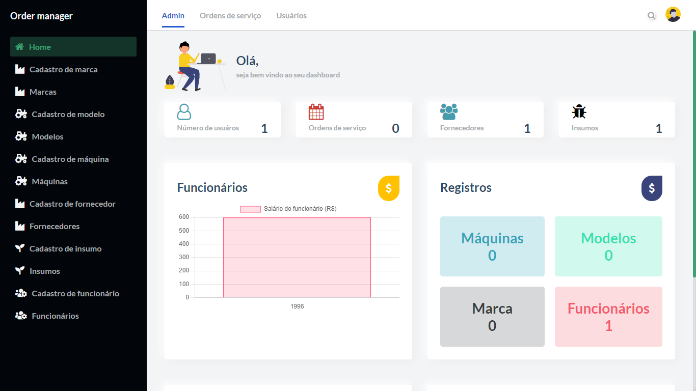

# Order manager

## About

To help manage warehouse, culminate business intelligence, statistics, data warehouse to assist in decision making within the company with agricultural inputs, suppliers, work orders with registration and scheduling, machines, brands and models.

## Requirements

- Nodejs (12, 14 and 16 tested)
- NPM (6.x or 7.x)

## Install dependencies

`npm install`

## To execute

`npm run dev`

## License

See [LICENSE](LICENSE.md)
